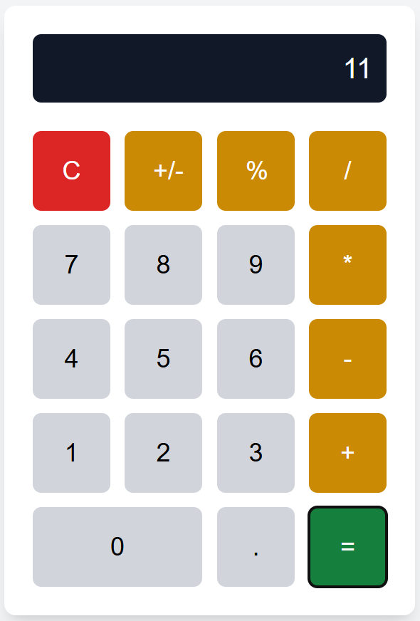

# Calculator TypeScript and Tailwind

**Languages / Jazyk / Мови**:

- [Česky](README.md)
- [English](README.en.md)
- [Українська](README.uk.md)

<p align="center">
  
</p>

This project is a simple calculator built with **TypeScript** and **Tailwind CSS**. The app allows basic arithmetic operations and features a clean, minimalist interface.

🔗 **[Open the calculator on GitHub Pages](https://mishastryzhka.github.io/Calculator-TypeScript-and-Tailwind/)**

## Features

- Built with **TypeScript** for safer, structured code.
- **Tailwind CSS** used for fast and flexible styling.
- Interactive interface with button animations.
- Supports basic arithmetic operations:
  - Addition, subtraction, multiplication, division
  - Percentage
  - Sign toggle (positive/negative)

## Project Structure

Calculator-TypeScript-and-Tailwind/ <br>
├── dist/ # Compiled files (JS, CSS, HTML) for production <br>
├── src/ <br>
│ ├── index.ts # Main TypeScript file for calculator logic <br>
│ ├── input.css # Tailwind CSS input file <br>
│ └── index.html # Main HTML file <br>
├── package.json # npm scripts and dependencies <br>
├── tailwind.config.js # Tailwind CSS configuration <br>
└── tsconfig.json # TypeScript configuration

## Getting Started

### Prerequisites

- **Node.js** (version 12 or higher)
- **npm** (usually installed with Node.js)

### Installation

1. Clone the repository:

   ```bash
   git clone https://github.com/MishaStryzhka/Calculator-TypeScript-and-Tailwind.git
   cd Calculator-TypeScript-and-Tailwind
2. Install dependencies:

   ```bash
   npm install

3. Start the project in development mode:

   ```bash
   npm start
   
4. To create a production build:

   ```bash
   npm run build
   
5. To deploy to GitHub Pages:

   ```bash
   npm run deploy

### Technologies

- TypeScript — used for structuring and improving code reliability.
- Tailwind CSS — a fast and modular CSS framework for styling.
- Web Dev Server — to run a local server with hot reload support.
- gh-pages — for deploying the project to GitHub Pages.
- 
### npm Scripts

- npm start — starts the development server with live reload and watches for changes in TypeScript, Tailwind CSS, and HTML.
- npm run build — creates the production build of the project.
- npm run deploy — deploys the project to GitHub Pages.
- npm run copy:html — copies index.html from src to dist (used automatically in other scripts).

### Links

🔗 **[Demo on GitHub Pages](https://mishastryzhka.github.io/Calculator-TypeScript-and-Tailwind/)**

🔗 **[Repository on GitHub](https://github.com/MishaStryzhka/Calculator-TypeScript-and-Tailwind)**

 ### License
 
This project is licensed under the MIT License. See the LICENSE file for details.
